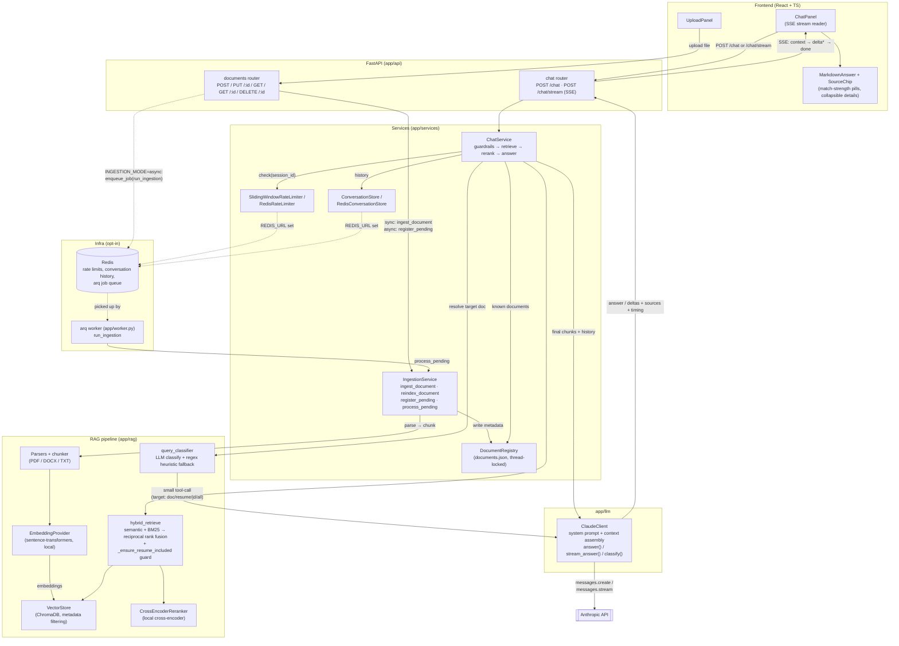

# Career Intelligence Assistant

A RAG system that analyzes a resume against one or more job descriptions and
answers questions about fit, skill gaps, experience alignment, and interview
prep. Built as a take-home for a Forward Deployed Engineer role — see
[`PRD.md`](./PRD.md) for the full scope, architecture decisions, and
hour-by-hour build plan this repo follows.

## Quick start

```bash
cp .env.example .env
# edit .env and set ANTHROPIC_API_KEY

docker-compose up --build
```

- Frontend: http://localhost:3000
- Backend API + docs: http://localhost:8000/docs

The first `docker-compose up --build` bakes the local embedding and
re-ranking models into the backend image at build time (see
`backend/Dockerfile`), so it takes a few minutes once; subsequent starts are
fast and need no network at request time for embeddings/reranking. Only the
Claude API call needs network + your API key at runtime.

`docker-compose up` also starts a `redis` service and a `worker` service
alongside `backend`/`frontend`. Both are opt-in at the application level —
the backend defaults to in-process rate limiting/conversation memory and
synchronous ingestion (see "Features" below) — but the containers
themselves start either way, so flipping `REDIS_URL`/`INGESTION_MODE` in
`.env` doesn't require restructuring your compose setup, just restarting
the backend.

### Running without Docker (faster iteration)

```bash
# backend
cd backend
python3 -m venv .venv && source .venv/bin/activate
pip install -r requirements.txt
cp .env.example .env  # set ANTHROPIC_API_KEY
uvicorn app.main:app --reload

# frontend, in another terminal
cd frontend
npm install
npm run dev
```

`scripts/smoke_test_pipeline.py` in `backend/` runs parsing → chunking →
hybrid retrieval → reranking end to end on sample text, without needing a
Claude API key — useful for sanity-checking the RAG pipeline in isolation.

## Architecture

```
backend/app/
  api/        — FastAPI routes (documents, chat, chat/stream) + DI wiring — no business logic
  services/   — orchestration: ingestion_service, chat_service, document_registry, conversation_store
  rag/        — parsers, chunking, embeddings, vector_store, retrieval, reranker, query_classifier
  llm/        — Claude client: system prompt, context assembly, the API call (plain + streaming + classify)
  core/       — config (env-driven settings), logging (structlog + timing), exceptions, rate limiting
  models/     — Pydantic schemas shared across every layer
  worker.py   — arq worker entrypoint for async ingestion (INGESTION_MODE=async only)

frontend/src/
  api/        — typed fetch client (incl. SSE stream reader) + types mirroring the backend schemas exactly
  components/ — UploadPanel, ChatPanel (streams responses token-by-token), MarkdownAnswer, SourceChip,
                + hand-rolled UI primitives
  lib/        — matchStrength (score → plain-English label), small client-side helpers
```

`EmbeddingProvider` (`app/rag/embeddings.py`) and `VectorStore`
(`app/rag/vector_store.py`) are the two interfaces in this codebase built
around dependency injection on purpose — they're the seams most likely to
change (swapping in a hosted embedding API, or FAISS/Qdrant later). Nothing
else is injected "for its own sake."

### Request flow

The diagram below is the whole system: every box is a real module in this
repo, every arrow a real call. The two paths that matter most are the
vertical spine down the middle — upload a document, ask a question — and
the dashed lines into Redis, which the top half of the pipeline runs
without whenever `REDIS_URL`/`INGESTION_MODE` are left at their defaults.



Two guardrails run before any Claude call in the chat path: the rate
limiter (`RateLimit`, 429 once a session exceeds its window) and a
no-documents check (`NoDocumentsUploadedError`, 400 if a resume or job
description hasn't been uploaded yet) — both shown implicitly inside
`ChatService` above.

## Key decisions (see PRD.md §3 and §5 for the full reasoning)

- **Embeddings & reranking run locally** (`sentence-transformers`, no API
  key) — the biggest reliability win for anyone running this cold.
- **ChromaDB**, chosen over FAISS specifically for native metadata
  filtering, which the document-type query filter depends on.
- **Hybrid retrieval**: semantic (Chroma) + keyword (BM25) merged via
  reciprocal rank fusion, then **re-ranked by a local cross-encoder** before
  context assembly — see `backend/tests/test_retrieval.py` for a test that
  demonstrates BM25 recovering a chunk semantic-only search missed entirely.
- **Grounding guardrail**: the system prompt instructs Claude to say when
  context is insufficient rather than reach for outside knowledge; low
  retrieval/rerank scores additionally flag a response as `grounded: false`
  so the UI can surface a low-confidence warning.
- **Rate limiting and conversation memory** default to in-process
  implementations (fine for a single instance), and switch to Redis-backed
  ones automatically when `REDIS_URL` is set — see "Features" below.
- **Conversation memory** is session-scoped, keyed by the frontend's
  per-tab `session_id` — prior turns' plain Q&A text is replayed to Claude
  on each new turn, but old _retrieved context_ is not re-sent, so tokens
  don't grow unboundedly across a long conversation.
- **Streaming** (`POST /chat/stream`, SSE) runs the same guardrail →
  retrieve → rerank pipeline as the plain endpoint, then streams Claude's
  answer token-by-token. Sources arrive in a `context` event _before_ the
  text starts streaming, so the UI can show what's grounding the answer
  while it's still being generated — one retry policy applies to the plain
  endpoint's single call, not the stream (retrying after partial output was
  already sent to the client would duplicate it; a stream failure instead
  surfaces as an `error` SSE event).

## Features

Everything implemented in this repo, grouped by area. Items introduced
after the original P0/P1 build are called out as such, but every item below
is live in `main` today — this list, not a changelog, is the source of
truth for "what does this app actually do."

### Document ingestion & management

- Upload a resume or job description as PDF, DOCX, or TXT (`POST
/documents`) — parsed, chunked, embedded (local `sentence-transformers`,
  no API key), and stored in ChromaDB with document-type metadata.
- Guardrails on upload: unsupported extensions, zero-byte files, and
  oversized uploads are rejected with the right 4xx and error code rather
  than a raw parser exception or an unhandled 500 (`test_edge_cases.py`,
  `test_ingestion_guardrails.py`) — this includes files that are garbage
  content wearing a `.pdf`/`.docx` extension, not just wrong extensions.
- List all documents (`GET /documents`), fetch one by id with its current
  status (`GET /documents/{id}`), and delete one (`DELETE
/documents/{id}`).
- _(post-P1)_ **Re-index in place** (`PUT /documents/{id}`,
  `IngestionService.reindex_document`): replaces a document's chunks —
  same `document_id`, same position in the list — instead of the old
  delete-then-re-upload dance. Not fully atomic (a query landing between
  the delete and the re-add would briefly see zero chunks for that
  document); named as an acceptable tradeoff in the method's docstring.
- _(post-P1)_ **Async ingestion** (`INGESTION_MODE=async`, default
  `sync`): `POST /documents` returns `202` immediately with a `pending`
  document instead of blocking the request on parse/chunk/embed. An `arq`
  (Redis-backed) worker (`app/worker.py`) picks up the job and runs the
  same pipeline out of band via `IngestionService.process_pending()`,
  flipping the document to `ready` (or `failed`, with `error_message` set)
  when done — a worker never crashes or infinitely retries on one bad
  file. Off by default (requires Redis); the frontend doesn't poll
  `GET /documents/{id}` for this yet (see PRD.md §12).
- Concurrent-safe ingestion: multiple uploads racing against the same
  `DocumentRegistry` (`threading.Lock`-protected) don't lose writes or
  collide on `document_id` — exercised directly by
  `asyncio.gather()`-driven tests.

### Retrieval & grounding

- **Hybrid retrieval**: semantic search (Chroma, cosine similarity) +
  BM25 keyword search, merged via reciprocal rank fusion — recovers
  exact-term matches (e.g. "Kubernetes") that a pure embedding search
  sometimes ranks low; demonstrated directly in `test_retrieval.py`.
- **Local cross-encoder reranking** of the fused candidate set before it
  reaches Claude — no external API call, no added per-question cost.
- **Document-targeted retrieval**: a query naming a specific job ("Job
  #2") or the resume/JDs in general is narrowed to that scope before
  retrieval runs, via `classify_query_target`. _(post-P1)_ This now
  defaults to an **LLM-based classifier** (`QUERY_CLASSIFIER_MODE=llm`) —
  a small, schema-constrained Claude tool-call (`ClaudeClient.classify`,
  `app/rag/query_classifier.py`) — with the original regex/keyword
  heuristic kept as the automatic fallback on any timeout or error
  (`QUERY_CLASSIFIER_TIMEOUT_SECONDS`, default 3s), and directly
  selectable via `QUERY_CLASSIFIER_MODE=heuristic`. Tradeoff named rather
  than hidden: one extra small Claude call (latency + cost) per question,
  in exchange for handling phrasing the regex never anticipated.
- **`_ensure_resume_included` guard**: any JD-narrowing filter is OR'd
  with an explicit resume clause, so a JD-targeted question (which is what
  most real questions here are — "what am I missing for this role") never
  silently excludes the resume from context. Fixes a real bug where the
  app answered "no resume found" despite one being uploaded.
- **Grounding guardrail**: the system prompt instructs Claude to say when
  context is insufficient rather than reach for outside knowledge; low
  retrieval/rerank scores additionally flag a response `grounded: false`
  so the UI can surface a low-confidence warning independent of what
  Claude itself says.

### Chat & conversation

- Two chat endpoints on the same pipeline (guardrails → hybrid retrieve →
  rerank → Claude): `POST /chat` (single JSON response) and `POST
/chat/stream` (SSE, token-by-token). The stream emits a `context` event
  with sources _before_ any answer text, so the UI can show what's
  grounding the answer while it's still being generated.
- **Session-scoped conversation memory**, keyed by the frontend's per-tab
  `session_id` — prior turns' plain Q&A text replays to Claude on each new
  turn; old _retrieved context_ is not re-sent, so tokens don't grow
  unboundedly across a long conversation.
- **Per-session rate limiting** (sliding window; `RATE_LIMIT_REQUESTS` /
  `RATE_LIMIT_WINDOW_SECONDS`).
- _(post-P1)_ Both conversation memory and rate limiting default to
  in-process implementations (fine for a single instance) and switch
  automatically to Redis-backed ones (`RedisConversationStore` — capped,
  TTL'd Redis `LIST`; `RedisRateLimiter` — sorted-set
  `ZADD`/`ZREMRANGEBYSCORE`/`ZCARD`) when `REDIS_URL` is set. Same
  interface either way, so `ChatService` doesn't know which is running;
  parity between the two is tested directly via `fakeredis`
  (`tests/test_redis_backed_stores.py`), not just asserted in a docstring.

### Frontend UX

- Upload panel showing every document's type, label, and status; the chat
  input stays disabled (with example questions suggested instead) until at
  least one resume and one job description are uploaded.
- _(post-P1 UX pass)_ Chat answers render as actual formatted markdown
  (`MarkdownAnswer`, wrapping `react-markdown`) instead of raw
  pre-wrapped text, matching the system prompt's "one-line summary, then a
  short breakdown" structure.
- _(post-P1 UX pass)_ Each retrieved source shows a plain-English
  match-strength pill ("Strong match" / "Relevant" / "Weak match",
  `lib/matchStrength.ts`) instead of a raw score by default — the exact
  retrieval/rerank scores and the source snippet are one click away in the
  same chip, not removed.
- _(post-P1 UX pass)_ A "Based on your resume and Job #1" natural-language
  summary line above the source list, so a user gets the gist without
  reading every individual source chip.
- _(post-P1 UX pass)_ Low-confidence (`grounded: false`) answers surface
  as a real alert banner with an explanation, not small gray footnote text.
- _(post-P1 UX pass)_ Retrieval/rerank/LLM timings and token usage sit
  behind a collapsed-by-default "Show answer details" toggle with
  plain-English labels ("Searching your documents," "Tokens used: 512 in /
  96 out"), rather than an always-visible monospace debug line.

## What's cut, on purpose

See PRD.md §2 for the full list (multi-user auth, cloud deployment, OCR).
Production-grade rate limiting is no longer on this list — see "Features"
above. Nothing here is a forgotten feature — it's a named tradeoff given
the original 2-day budget.

## Testing

```bash
# backend
cd backend && source .venv/bin/activate && pytest -q

# frontend
cd frontend && npm run build && npx vitest run
```

Backend: 81 tests covering chunking metadata/overlap, the document-type
query classifier (both the keyword heuristic and the LLM-based classifier,
including its fallback-on-failure and fallback-on-timeout paths), the
`_ensure_resume_included` guard that keeps a JD-targeted query from
excluding the resume from context, BM25+RRF fusion recovering a
keyword-strong chunk a semantic-only search missed, cross-encoder rerank
ordering, conversation history (ordering, per-session isolation, eviction
once the turn cap is hit -- run against both the in-process and
Redis/`fakeredis`-backed implementations to prove parity), the Redis-backed
rate limiter (same parity approach), guardrails (no-documents,
rate-limit-trip, oversized upload, empty/unsupported file), per-document
re-indexing (`PUT /documents/{id}`, keeps its document_id, 404s on an
unknown one), async ingestion (the arq task function, the
pending->ready/failed status transitions, the `202` route branch, and that
the default `INGESTION_MODE=sync` behaves exactly as before), edge cases
(malformed uploads hitting the real parsers, concurrent ingestion, a
stream-consumer disconnecting mid-answer), and route-level integration
tests against the real FastAPI app (`tests/test_api_routes.py`, via
`httpx.ASGITransport` + `app.dependency_overrides`) — all run without
hitting the network or needing an API key or a real Redis/arq worker.

That last file exists because of a real bug it caught: `get_chat_service`
and `get_ingestion_service` originally took a plain `settings: Settings |
None = None` parameter for testing convenience. FastAPI's dependency
resolver doesn't know that's "just a default" — a Pydantic-model-typed
parameter with no `Depends`/`Query`/`Path` marker is exactly what it treats
as an _implicit second request-body field_. `POST /chat` and `POST
/documents` were silently expecting `{"request": {...}, "settings": {...}}`
instead of a flat body, and every unit test up to that point was calling the
service classes directly, so nothing exercised the actual HTTP request
parsing to notice. Fixed by resolving `settings` via `Depends(get_settings)`
like everything else in `deps.py` — see the comment in `app/api/deps.py` for
the full explanation. It's a good example of why route-level tests earn
their keep even when the unit tests below them are solid.

Frontend: a build/type-check pass plus ChatPanel tests that drive the same
event-callback shape `streamChatMessage` uses in production (context →
delta → done, and a guardrail `error` event), and that the input is
disabled until both a resume and a JD are uploaded.

## What I'd do with more time

The five items that used to be listed here (a learned query classifier,
Redis-backed memory/rate limiting, a real ingestion job queue, broader
edge-case tests, per-document re-index) are now implemented — see
"Features" above. What's next after that:

- A cross-process-safe document registry (a real database, or at least file
  locking) — `documents.json` is now written by two processes (the backend
  and the arq worker) with only in-process locking; named explicitly in
  `document_registry.py`'s docstring rather than silently assumed
- Frontend support for the post-P1 additions: a "re-index" action next to
  each document, and a "processing…" state driven by polling
  `GET /documents/{id}` when `INGESTION_MODE=async` — both backend
  endpoints exist and are tested, but nothing in the UI calls them yet
- A fully trained (not zero-shot) query classifier, if per-query LLM
  latency/cost ever becomes a problem at real traffic volume
- Voyage AI / OpenAI embedding swap-in (the `EmbeddingProvider` interface
  already supports it — just needs the provider class and an API key)
